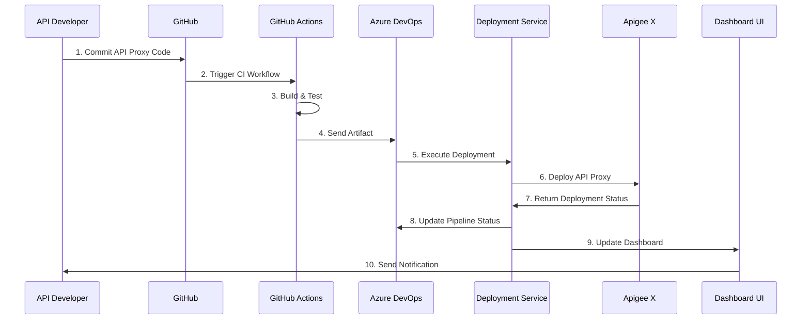

# Apigee X Deployment Solution

A web-based platform for managing API proxy deployments to Apigee X on Google Cloud Platform using GitHub Actions and Azure DevOps integration.

## Overview

The Apigee X Deployment Solution streamlines the process of deploying and managing API proxies on Google Cloud Platform's Apigee X. It leverages GitHub Actions for continuous integration and Azure DevOps for deployment orchestration, providing a unified dashboard for the complete API lifecycle management.

## Key Features

- **Unified Dashboard**: Centralized view of all API proxies, deployments, and environments
- **GitHub Actions Integration**: Automated build, testing, and validation workflows
- **Azure DevOps Integration**: Sophisticated release management and deployment pipelines
- **Multi-Environment Support**: Configure and manage multiple environments (Dev, Test, Staging, Prod)
- **Deployment History**: Track and manage deployment versions with rollback capabilities
- **Environment-Specific Configurations**: Manage variables and settings per environment
- **Security Controls**: Role-based access and approval gates for production deployments
- **Monitoring & Alerting**: Track deployment status and receive notifications

## Architecture

### System Architecture

The solution follows a layered architecture:

- **Frontend Layer**: Web UI dashboard built with modern web technologies
- **Middle Layer**: Service-oriented backend handling business logic
- **Integration Layer**: Connectors to GitHub, Azure DevOps, Apigee, and GCP
- **Data Layer**: Database and storage for configurations and deployment state

# Apigee X Deployment Solution - Architecture & Design Flow


## System Architecture

The Apigee X Deployment Solution implements a modern, layered architecture designed to provide scalability, maintainability, and clear separation of concerns.

```
┌─────────────────────────────────────────────────────────────────────┐
│                           Frontend Layer                             │
│                                                                     │
│  ┌──────────────────┐                 ┌───────────────────────────┐ │
│  │   Web Dashboard  │◄───REST API────►│        API Gateway        │ │
│  └──────────────────┘                 └───────────────────────────┘ │
└─────────────────────────────────────────────────────────────────────┘
                               │
                               ▼
┌─────────────────────────────────────────────────────────────────────┐
│                           Middle Layer                               │
│                                                                     │
│  ┌──────────────┐  ┌─────────────────┐  ┌───────────────────────┐  │
│  │ Auth Service │  │ Proxy Management│  │  Deployment Service   │  │
│  └──────────────┘  └─────────────────┘  └───────────────────────┘  │
│                                                                     │
│  ┌──────────────┐  ┌─────────────────┐  ┌───────────────────────┐  │
│  │ Env Service  │  │ Pipeline Service│  │   Caching (Redis)     │  │
│  └──────────────┘  └─────────────────┘  └───────────────────────┘  │
└─────────────────────────────────────────────────────────────────────┘
                               │
                               ▼
┌─────────────────────────────────────────────────────────────────────┐
│                        Integration Layer                             │
│                                                                     │
│  ┌───────────────┐  ┌────────────────┐  ┌────────────────────────┐ │
│  │  GitHub API   │  │ Azure DevOps   │  │     Apigee X API       │ │
│  │    Client     │  │     Client     │  │        Client          │ │
│  └───────────────┘  └────────────────┘  └────────────────────────┘ │
│                                                                     │
│  ┌──────────────────────────────────────────────────────────────┐  │
│  │                Google Cloud Platform API Client               │  │
│  └──────────────────────────────────────────────────────────────┘  │
└─────────────────────────────────────────────────────────────────────┘
                               │
                               ▼
┌─────────────────────────────────────────────────────────────────────┐
│                           Data Layer                                 │
│                                                                     │
│  ┌──────────────┐  ┌─────────────────┐  ┌───────────────────────┐  │
│  │   Database   │  │  Log Storage    │  │   Metrics Storage     │  │
│  └──────────────┘  └─────────────────┘  └───────────────────────┘  │
└─────────────────────────────────────────────────────────────────────┘
```

### Layer Description

1. **Frontend Layer**
   - Web Dashboard: The user interface built with HTML5, CSS3, TailwindCSS, and Alpine.js
   - API Gateway: Routes requests to appropriate backend services

2. **Middle Layer**
   - Authentication Service: Handles user authentication and authorization
   - Proxy Management Service: Manages API proxy configurations and versions
   - Deployment Service: Orchestrates the deployment process across environments
   - Environment Service: Manages environment-specific configurations
   - Pipeline Service: Configures and monitors CI/CD pipelines
   - Caching Service: Improves performance by caching frequently accessed data

3. **Integration Layer**
   - GitHub API Client: Integrates with GitHub for source code management
   - Azure DevOps API Client: Connects to Azure DevOps for pipeline execution
   - Apigee X API Client: Interfaces with Apigee X Management API
   - Google Cloud Platform API Client: Interacts with GCP services

4. **Data Layer**
   - Database: Stores configurations, user data, and system state
   - Log Storage: Maintains comprehensive logs for auditing and troubleshooting
   - Metrics Storage: Captures performance and operational metrics

## Deployment Flow Diagram

The following diagram illustrates the end-to-end flow of deploying an API proxy from development to production.

```
┌─────────────┐     ┌───────────────┐     ┌───────────────┐     ┌─────────────────┐
│  Developer  │────►│    GitHub     │────►│GitHub Actions │────►│   Azure DevOps  │
│             │     │  Repository   │     │    CI/CD      │     │     Pipeline    │
└─────────────┘     └───────────────┘     └───────────────┘     └─────────────────┘
                                                                         │
                                                                         ▼
┌─────────────┐     ┌───────────────┐     ┌───────────────┐     ┌─────────────────┐
│ Monitoring  │◄────│  Deployment   │◄────│  Apigee X     │◄────│ Deployment      │
│ Dashboard   │     │   Service     │     │  on GCP       │     │ Configurations  │
└─────────────┘     └───────────────┘     └───────────────┘     └─────────────────┘
```

## Detailed Deployment Process

1. **Code Development and Commit**
   - Developer creates or modifies API proxy
   - Changes are committed to GitHub repository

2. **Continuous Integration (GitHub Actions)**
   - Automated workflow triggered by commit/PR
   - Validate API proxy structure and policies
   - Run unit tests and code quality checks
   - Build API proxy bundle
   - Generate deployment artifacts

3. **Deployment Orchestration (Azure DevOps)**
   - Receive artifacts from GitHub Actions
   - Apply environment-specific configurations
   - Execute deployment pipeline
   - Manage approval gates for production environments

4. **API Proxy Deployment (Deployment Service)**
   - Send deployment request to Apigee X API
   - Monitor deployment progress
   - Verify deployment success
   - Handle error conditions and rollbacks

5. **Monitoring and Notification**
   - Update deployment status in dashboard
   - Send notifications to stakeholders
   - Record deployment metrics
   - Generate deployment reports

## Environment-Specific Flow

```
                           ┌──────────────────┐
                           │  Build Pipeline  │
                           └──────────────────┘
                                    │
                                    ▼
                          ┌────────────────────┐
                          │   Artifact Storage │
                          └────────────────────┘
                                    │
                                    ▼
┌────────────────────────────────────────────────────────────────────────┐
│                       Release Pipeline                                  │
│                                                                        │
│  ┌──────────────┐     ┌──────────────┐     ┌──────────────┐           │
│  │  Development │────►│     Test     │────►│   Staging    │──────┐    │
│  │  Environment │     │  Environment │     │  Environment │      │    │
│  └──────────────┘     └──────────────┘     └──────────────┘      │    │
│    │ Auto-Deploy        │ Auto-Deploy        │ Manual Approval   │    │
│    │ No Approval        │ Team Approval      │                   ▼    │
│    ▼                    ▼                    ▼               ┌──────┐ │
│ ┌──────────────┐    ┌──────────────┐    ┌──────────────┐    │ Prod │ │
│ │  Dev Tests   │    │  QA Tests    │    │  UAT Tests   │    │      │ │
│ └──────────────┘    └──────────────┘    └──────────────┘    └──────┘ │
│                                                           Manual      │
│                                                           Approval    │
└────────────────────────────────────────────────────────────────────────┘
```

## System Components Interaction



## Security Architecture

```
┌─────────────────────────────────────────────────────────────┐
│                     Security Layer                           │
│                                                             │
│  ┌─────────────┐  ┌─────────────┐  ┌────────────────────┐  │
│  │ OAuth 2.0   │  │ RBAC Access │  │ Environment-based  │  │
│  │ Auth        │  │ Control     │  │ Security Policies  │  │
│  └─────────────┘  └─────────────┘  └────────────────────┘  │
│                                                             │
│  ┌─────────────┐  ┌─────────────┐  ┌────────────────────┐  │
│  │ API Keys    │  │ Service     │  │ Secrets            │  │
│  │ Management  │  │ Accounts    │  │ Management         │  │
│  └─────────────┘  └─────────────┘  └────────────────────┘  │
└─────────────────────────────────────────────────────────────┘
```

## Data Flow and Storage

```
┌────────────┐     ┌────────────┐     ┌────────────┐     ┌────────────┐
│  API Proxy │────►│Environment │────►│ Deployment │────►│  History   │
│   Data     │     │    Data    │     │    Data    │     │    Data    │
└────────────┘     └────────────┘     └────────────┘     └────────────┘
       │                 │                  │                  │
       └─────────────────┴──────────────────┴──────────────────┘
                                │
                                ▼
                        ┌───────────────┐
                        │   Database    │
                        └───────────────┘
                                │
                                ▼
        ┌─────────────────────────────────────────────┐
        │                                             │
┌───────────────┐     ┌───────────────┐     ┌───────────────┐
│  Audit Logs   │     │  Error Logs   │     │ Activity Logs │
└───────────────┘     └───────────────┘     └───────────────┘
```

## Scaling and High Availability

The architecture is designed to scale horizontally with increasing load:

- **Web Tier**: Multiple web server instances behind a load balancer
- **Service Tier**: Stateless services that can be scaled independently
- **Data Tier**: Replicated database with read replicas for performance
- **Cache Tier**: Distributed Redis cache for performance optimization

## Implementation Roadmap

```
Phase 1: Core Platform (1-2 months)
├── Basic Dashboard UI
├── GitHub Integration
├── Simple Deployment Flow
└── Basic Monitoring

Phase 2: Advanced Features (2-3 months)
├── Azure DevOps Integration
├── Multi-Environment Support
├── Approval Workflows
└── Deployment History

Phase 3: Enterprise Features (3-4 months)
├── Advanced Analytics
├── Role-Based Access Control
├── Audit Logging
└── Custom Pipeline Templates
```


This architecture provides a robust foundation for automating and managing API proxy deployments to Apigee X using GitHub Actions and Azure DevOps. The design emphasizes:

- Clear separation of concerns
- Scalability and maintainability
- Secure deployment processes
- Comprehensive monitoring and reporting
- Flexible integration with CI/CD tools

By implementing this architecture, teams can achieve faster, more reliable API deployments while maintaining governance and control over the deployment process.

### Deployment Flow

1. **Code Commit**: Developer pushes API proxy code to GitHub repository
2. **CI Pipeline**: GitHub Actions triggers to build, validate, and test the API proxy
3. **Artifact Creation**: GitHub Actions creates deployment artifacts
4. **CD Pipeline**: Azure DevOps receives artifacts and initiates deployment
5. **Environment Configuration**: Environment-specific variables are applied
6. **Approval Workflow**: Optional approval gates for higher environments
7. **Deployment**: API proxy is deployed to Apigee X on GCP
8. **Validation**: Post-deployment validation ensures successful deployment
9. **Notification**: Stakeholders are notified of deployment status

## Technical Stack

- **Frontend**: HTML5, CSS3, TailwindCSS, Alpine.js, ApexCharts
- **Authentication**: OAuth 2.0, Service Account authentication
- **Integration**: GitHub API, Azure DevOps API, Apigee X Management API, Google Cloud API
- **Deployment**: GitHub Actions, Azure DevOps Pipelines
- **Target Platform**: Apigee X on Google Cloud Platform

## Setup and Installation

### Prerequisites

- Google Cloud Platform account with Apigee X enabled
- GitHub repository for storing API proxies
- Azure DevOps account for deployment pipelines
- Required permissions for GitHub and Azure DevOps integrations

### Configuration Steps

1. **GitHub Setup**:
   - Create/configure a repository for your API proxies
   - Setup GitHub Actions workflow templates
   - Configure required secrets and variables

2. **Azure DevOps Setup**:
   - Create project and pipeline definitions
   - Configure service connections to GitHub and GCP
   - Setup environment-specific release pipelines

3. **Google Cloud Platform Setup**:
   - Configure Apigee X organization and environments
   - Setup service accounts with appropriate permissions
   - Enable required APIs for integration

4. **Deployment Dashboard Setup**:
   - Configure connection settings for all integrations
   - Setup environment variables and deployment options
   - Configure user accounts and permissions

## Usage

### API Proxy Development and Deployment

1. Develop API proxy in local environment
2. Commit and push changes to GitHub repository
3. GitHub Actions automatically builds and tests the proxy
4. After successful CI, Azure DevOps initiates deployment
5. Monitor deployment progress in the dashboard
6. Approve deployment to production when ready
7. View deployment history and monitor performance

### Environment Management

1. Navigate to Environments section in dashboard
2. Configure environment-specific variables
3. Setup deployment rules and approvals
4. Monitor environment health and status

### Deployment History and Rollback

1. Access Deployment History in the dashboard
2. View details of past deployments
3. Compare deployment versions
4. Initiate rollback if needed

## Dashboard Sections

- **Dashboard**: Overview of deployment statistics and recent activities
- **API Proxies**: List and management of API proxies
- **Deployments**: Deployment operations and history
- **Environments**: Environment configuration
- **CI/CD Pipelines**: Pipeline configuration and execution
- **GitHub Actions**: GitHub integration settings
- **Azure DevOps**: Azure DevOps configuration
- **Settings**: Application configuration options

## Security Considerations

- Use service accounts with minimal required permissions
- Implement approval gates for production deployments
- Secure storage of API keys and credentials
- Regular audit of user permissions and access
- Enable logging for all deployment operations

## Troubleshooting

### Common Issues

- **Deployment Failures**: Check logs in GitHub Actions and Azure DevOps
- **Authentication Errors**: Verify service account permissions
- **Integration Issues**: Ensure API keys and configurations are correct
- **Environment Configuration**: Verify environment-specific variables

### Logging and Debugging

- View detailed logs in GitHub Actions workflows
- Check Azure DevOps pipeline logs for deployment details
- Access GCP Cloud Logging for Apigee X logs
- Dashboard provides links to relevant logs for each deployment

## Contributing

Guidelines for contributing to the project, including:
- Code style and standards
- Pull request process
- Issue reporting
- Feature requests

## License

[License information]

## Contact

[Contact information for project maintainers]
